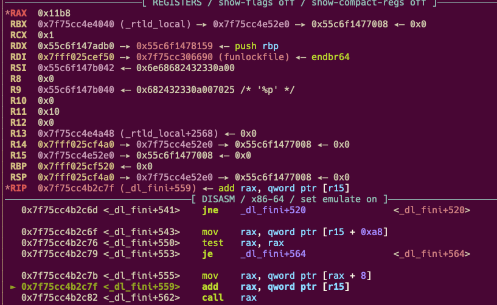
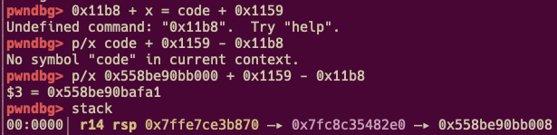

# Wall-Maria

栈上有 `_dl_global->link_map` 的地址，类似`house_of_banana`，由于给了`main_addr`在 `fini_arry`后面

而且 `link_map[0]` 是`l_addr`，将其 +8 在最后 exit 的时候就会调用`main`

- format string bug on non-stack variables

- 返回到gets, rdi 刚好是栈地址，且在rsp - 0x530的位置

- 先改下面的栈指针链，利用`_dl_fini`再回到main

    

  `r15`是`&link_map->l_addr`然后，这个地址也在栈上，算好偏移就可以再回到`main`

    

**注意:**和 qemu 交互有 tty 问题，可以参考 SECCON2023-umemo 中 `mephi42`师傅的 wp <a href="https://ctftime.org/writeup/37933">此链接</a>

